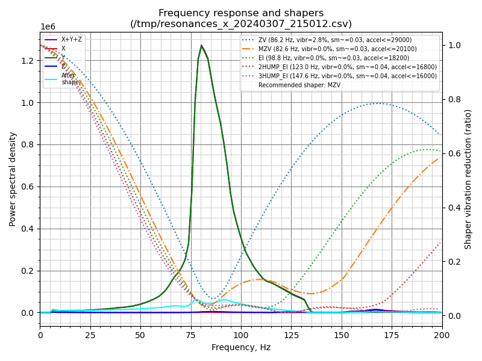
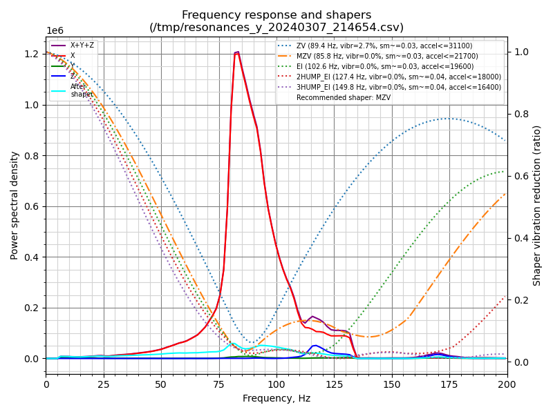

# What's this?

It's Crossant, an affordable 3d printer with lots of configuration options to make it accessible for everyone. Currently on open beta which you can join from [Discord](https://discord.gg/poleengineering) server!
https://github.com/Pole-Engineering

# Important links:

Docs: https://docs.pole.engineering (WIP)
Discord: https://discord.gg/poleengineering
BOM: https://docs.google.com/spreadsheets/d/1u00vXnCiODAP5KC5nTiRgINJnbgC2SU4T4h_pg1mv24/edit#gid=0

# Socials:

Discord: https://discord.gg/aQXhqzdWPY && https://discord.gg/poleengineering
Web: https://pole.engineering/
Instagram: https://instagram.com/poleengineering
X: https://x.com/poleengineering

# Input shaper graphs:

# Where can i access BOM?

There it is: https://docs.google.com/spreadsheets/d/1u00vXnCiODAP5KC5nTiRgINJnbgC2SU4T4h_pg1mv24/edit#gid=0

# Huge thanks and credits to:

Ocho Camino [Ice Cream Factory Discord](https://discord.gg/z9FmEpvTx3)
Deadlock,
Iamthesoy,
polygorg,
Caza,
LH [LH Stinger Discord](https://discord.gg/UBpmeDwvMc),
Zughal [Tsuarisu Discord](https://discord.gg/HnQ6rQJrPV)

Shield: [![CC BY-NC-SA 4.0][cc-by-nc-sa-shield]][cc-by-nc-sa]

This work is licensed under a
[Creative Commons Attribution-NonCommercial-ShareAlike 4.0 International License][cc-by-nc-sa].

[![CC BY-NC-SA 4.0][cc-by-nc-sa-image]][cc-by-nc-sa]

[cc-by-nc-sa]: http://creativecommons.org/licenses/by-nc-sa/4.0/
[cc-by-nc-sa-image]: https://licensebuttons.net/l/by-nc-sa/4.0/88x31.png
[cc-by-nc-sa-shield]: https://img.shields.io/badge/License-CC%20BY--NC--SA%204.0-lightgrey.svg