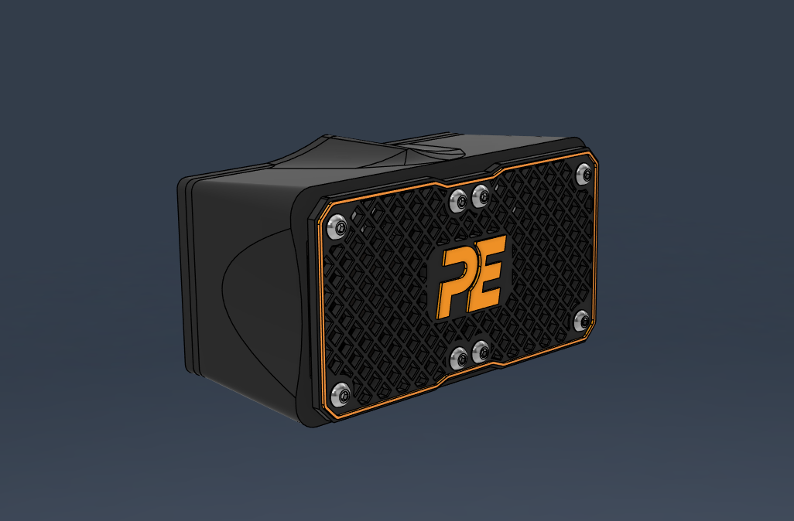
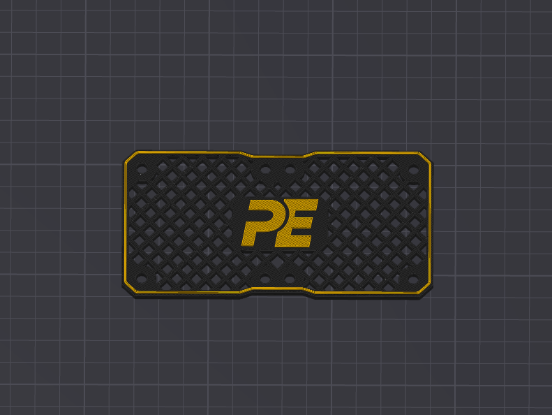

# Exhaust
We recommend using HEPA and activated carbon filters for the exhaust.

 
 
 

# Multicolor Print
You can access the multicolor 3MF file prepared for this purpose by clicking [here](https://github.com/Pole-Engineering/Crossant-235/blob/main/STLs/Exhaust/Multicolor%20Print/exhaust_front_grill_x1.3mf), or you can get the same print by changing the filament at layer 23.

 