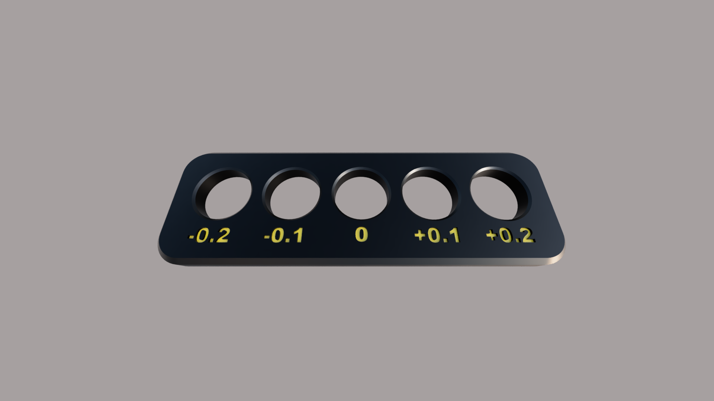

## Tolerances
You will encounter files containing XY joint and shaft support designs with five different tolerances. You should print   [print the tolerance test](https://github.com/Pole-Engineering/Crossant-235/blob/main/STLs/Tools/%5Bo%5D_tolerance_test.stl) to determine which tolerance to use for the parts. 

### Printed Part

The bearing needs to fit into one of the holes in the part with a press fit, so it should not be loose, and they should be a hard to do pressfit.