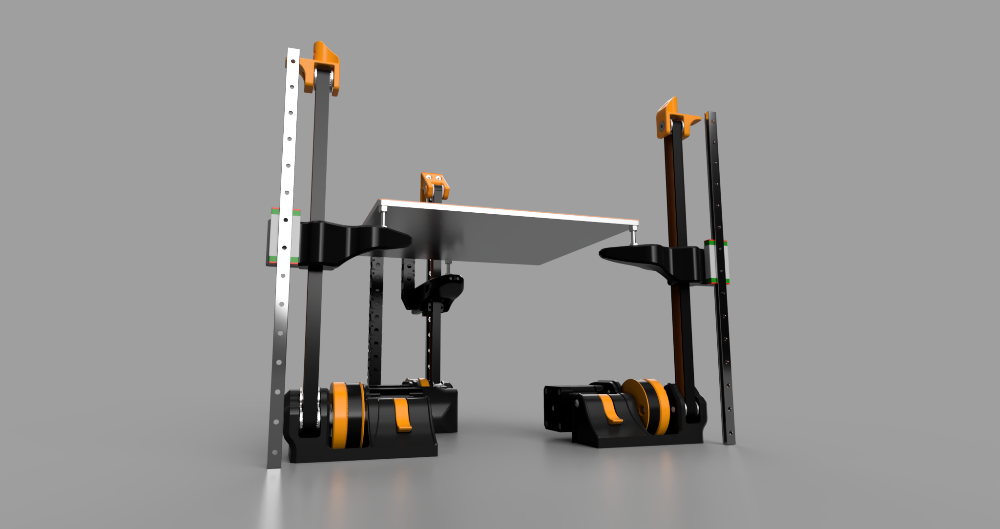

## Kinematic Belted Z 
Crossant's kinematic z system is based on [maxwell kinematic coupling](https://en.wikipedia.org/wiki/Kinematic_coupling#Maxwell_coupling). Using the z tilt command, it can level the bed in seconds.

